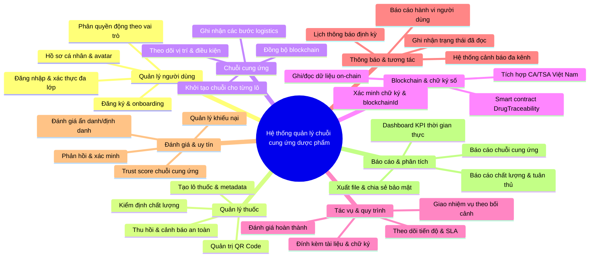
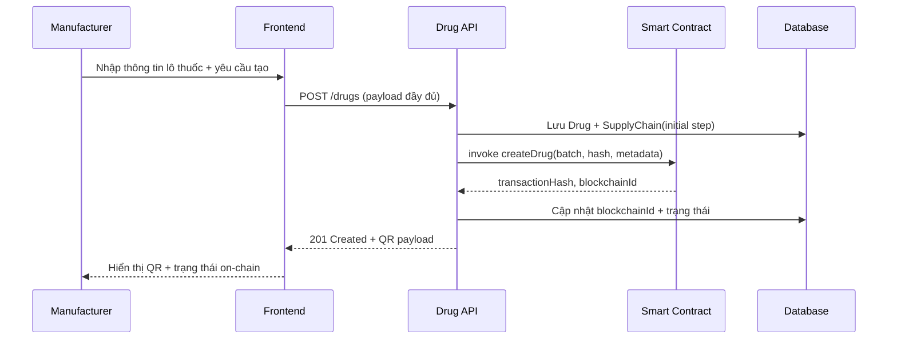
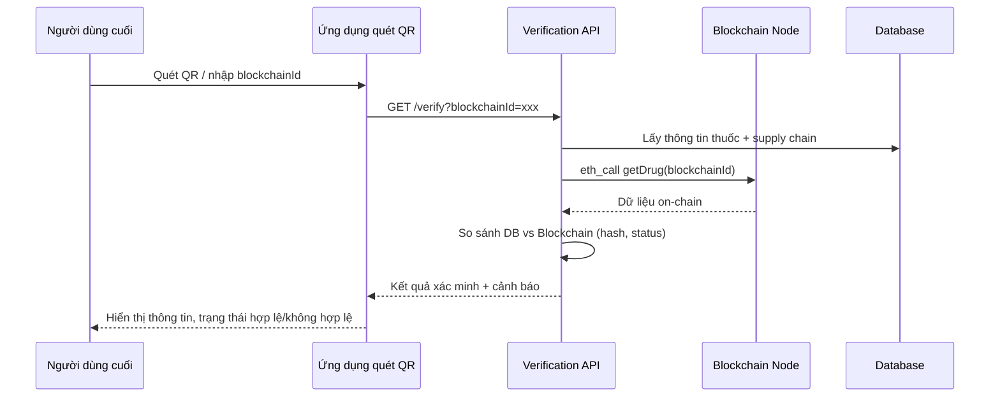

# Bộ mô hình thiết kế mới

Cập nhật toàn bộ sơ đồ chính của hệ thống quản lý chuỗi cung ứng dược phẩm tích hợp blockchain. Mỗi mô hình sử dụng chuẩn Mermaid để có thể nhúng trực tiếp vào tài liệu hoặc công cụ hỗ trợ.

---

## 1. Mô hình phân rã chức năng



---

## 2. Use Case tổng thể (Mermaid)

```mermaid
flowchart TB
    %% Định nghĩa actor
    Admin([Admin])
    Manufacturer([Nhà sản xuất])
    Distributor([Nhà phân phối])
    Hospital([Bệnh viện])
    Patient([Bệnh nhân])
    System([Hệ thống tự động])

    subgraph UC_User["Khối User & Bảo mật"]
        UC1[Đăng ký/Onboarding]
        UC2[Đăng nhập & MFA]
        UC3[Quản lý hồ sơ]
        UC4[Phân quyền & khóa tài khoản]
    end

    subgraph UC_Drug["Khối Thuốc & QR"]
        UC5[Tạo/Cập nhật lô thuốc]
        UC6[Phát hành & quét QR]
        UC7[Kiểm định chất lượng]
        UC8[Thu hồi & cảnh báo]
    end

    subgraph UC_Supply["Khối Chuỗi cung ứng"]
        UC9[Khởi tạo chuỗi]
        UC10[Ghi nhận bước logistics]
        UC11[Theo dõi điều kiện]
        UC12[Ghi dữ liệu lên blockchain]
    end

    subgraph UC_Task["Khối Nhiệm vụ & thông báo"]
        UC13[Tạo/Gán nhiệm vụ]
        UC14[Cập nhật tiến độ]
        UC15[Gửi/Lọc thông báo]
    end

    subgraph UC_Review["Khối Đánh giá & báo cáo"]
        UC16[Tạo & phản hồi đánh giá]
        UC17[Tính trust score]
        UC18[Xem/Xuất báo cáo]
    end

    %% Liên kết actor
    Admin --> UC1 & UC2 & UC3 & UC4 & UC5 & UC7 & UC8 & UC9 & UC10 & UC11 & UC12 & UC13 & UC14 & UC15 & UC16 & UC17 & UC18
    Manufacturer --> UC2 & UC3 & UC5 & UC6 & UC7 & UC9 & UC10 & UC11 & UC12 & UC13 & UC14 & UC16
    Distributor --> UC2 & UC3 & UC6 & UC10 & UC11 & UC13 & UC14 & UC15 & UC16
    Hospital --> UC2 & UC3 & UC6 & UC7 & UC10 & UC11 & UC13 & UC14 & UC15 & UC16
    Patient --> UC2 & UC3 & UC6 & UC16
    System --> UC2 & UC6 & UC11 & UC12 & UC15 & UC17
```



---

## 3. Sequence diagrams

### 3.1 Tạo lô thuốc mới và ghi nhận chuỗi cung ứng + blockchain



### 3.2 Cập nhật bước chuỗi cung ứng và đồng bộ nhiệm vụ

```mermaid
sequenceDiagram
    participant Actor as Distributor/Hospital
    participant FE as Frontend
    participant API as SupplyChain API
    participant Task as Task Service
    participant DB as Database

    Actor->>FE: Chọn chuỗi & nhập hành động (shipped/received/dispensed)
    FE->>API: POST /supply-chain/:id/steps
    API->>DB: Thêm step mới + cập nhật currentStatus/location
    API->>Task: Trigger tạo/cập nhật nhiệm vụ liên quan
    Task->>DB: Lưu task + gửi thông báo
    API-->>FE: 200 OK + hành trình cập nhật
    FE-->>Actor: Hiển thị timeline mới + nhiệm vụ kèm SLA
```

### 3.3 Quét QR và xác minh blockchain



---

## 4. Activity diagrams

### 4.1 Quy trình xử lý nhiệm vụ gắn với chuỗi cung ứng

```mermaid
flowchart TD
    A([Bắt đầu]) --> B{Có trigger tự động hay thủ công?}
    B -->|Tự động (SLA/Blockchain)| C[Tạo nhiệm vụ hệ thống]
    B -->|Thủ công (Admin/Actor)| D[Nhập thông tin nhiệm vụ]
    C --> E[Liên kết SupplyChain/Drug]
    D --> E
    E --> F{Đã gán người thực hiện?}
    F -->|Không| G[Đẩy vào hàng chờ phân công]
    F -->|Có| H[Gửi thông báo & deadline]
    G --> H
    H --> I[Người được gán cập nhật tiến độ]
    I --> J{Hoàn thành đúng hạn?}
    J -->|Có| K[Đánh dấu completed + nhật ký]
    J -->|Không| L[Kích hoạt cảnh báo quá hạn]
    K --> M([Kết thúc])
    L --> M
```

### 4.2 Quy trình thu hồi lô thuốc

```mermaid
flowchart TD
    Start([Phát hiện vấn đề chất lượng]) --> Check{Xác minh kết quả kiểm định}
    Check -->|Không đạt| Decide{Quyết định thu hồi?}
    Check -->|Đạt| End([Theo dõi tiếp])
    Decide -->|Có| Prepare[Chuẩn bị hồ sơ thu hồi]
    Prepare --> Update[Update Drug status = recalled]
    Update --> SCStep[Thêm bước supply chain "recall"]
    SCStep --> Notify[Gửi thông báo đa kênh]
    Notify --> Blockchain[Ghi sự kiện thu hồi lên blockchain]
    Blockchain --> QR[Đánh dấu cảnh báo khi quét QR]
    QR --> Audit[Lưu audit log & báo cáo cơ quan]
    Audit --> EndRecall([Kết thúc thu hồi])
```

---

### Hướng dẫn sử dụng

- Có thể copy trực tiếp từng khối ` ```mermaid ... ``` ` vào Markdown, Notion, hoặc công cụ hỗ trợ Mermaid để render.
- Khi cần tùy biến chi tiết (ví dụ thêm actor mới), chỉ cần bổ sung nút vào cùng cụm tương ứng trong sơ đồ.
