# USE CASE - HỆ THỐNG QUẢN LÝ CHUỖI CUNG ỨNG DƯỢC PHẨM

## 1. USE CASE DIAGRAM

```mermaid
graph TB
    %% Actors
    Admin[👤 Admin]
    Manufacturer[🏭 Nhà Sản Xuất]
    Distributor[🚚 Nhà Phân Phối]
    Hospital[🏥 Bệnh Viện]
    Patient[👨‍⚕️ Bệnh Nhân]
    System[⚙️ Hệ Thống]

    %% Use Cases - Quản lý User
    UC1[UC1: Đăng ký tài khoản]
    UC2[UC2: Đăng nhập]
    UC3[UC3: Đăng xuất]
    UC4[UC4: Quản lý thông tin cá nhân]
    UC5[UC5: Quản lý người dùng]

    %% Use Cases - Quản lý Thuốc
    UC6[UC6: Tạo lô thuốc]
    UC7[UC7: Cập nhật lô thuốc]
    UC8[UC8: Xem danh sách lô thuốc]
    UC9[UC9: Xem chi tiết lô thuốc]
    UC10[UC10: Xóa lô thuốc]
    UC11[UC11: Quét QR code]
    UC12[UC12: Xác minh thuốc trên blockchain]

    %% Use Cases - Chuỗi cung ứng
    UC13[UC13: Tạo bước trong chuỗi cung ứng]
    UC14[UC14: Cập nhật trạng thái vận chuyển]
    UC15[UC15: Xem lịch sử chuỗi cung ứng]
    UC16[UC16: Theo dõi vị trí real-time]

    %% Use Cases - Chữ ký số
    UC17[UC17: Ký số tài liệu]
    UC18[UC18: Xác thực chữ ký số]
    UC19[UC19: Thu hồi chữ ký số]

    %% Use Cases - Đánh giá
    UC20[UC20: Đánh giá thuốc/nhà cung cấp]
    UC21[UC21: Xem đánh giá]
    UC22[UC22: Cập nhật điểm tín nhiệm]

    %% Use Cases - Nhiệm vụ
    UC23[UC23: Tạo nhiệm vụ]
    UC24[UC24: Gán nhiệm vụ]
    UC25[UC25: Cập nhật trạng thái nhiệm vụ]

    %% Use Cases - Thông báo
    UC26[UC26: Gửi thông báo]
    UC27[UC27: Xem thông báo]
    UC28[UC28: Đánh dấu đã đọc]

    %% Relationships
    Admin --> UC5
    Admin --> UC10
    Admin --> UC19
    Admin --> UC22

    Manufacturer --> UC1
    Manufacturer --> UC2
    Manufacturer --> UC3
    Manufacturer --> UC4
    Manufacturer --> UC6
    Manufacturer --> UC7
    Manufacturer --> UC8
    Manufacturer --> UC9
    Manufacturer --> UC13
    Manufacturer --> UC17
    Manufacturer --> UC23

    Distributor --> UC1
    Distributor --> UC2
    Distributor --> UC3
    Distributor --> UC4
    Distributor --> UC8
    Distributor --> UC9
    Distributor --> UC14
    Distributor --> UC15
    Distributor --> UC16
    Distributor --> UC17
    Distributor --> UC24
    Distributor --> UC25

    Hospital --> UC1
    Hospital --> UC2
    Hospital --> UC3
    Hospital --> UC4
    Hospital --> UC8
    Hospital --> UC9
    Hospital --> UC11
    Hospital --> UC12
    Hospital --> UC15
    Hospital --> UC20
    Hospital --> UC21
    Hospital --> UC27
    Hospital --> UC28

    Patient --> UC1
    Patient --> UC2
    Patient --> UC3
    Patient --> UC4
    Patient --> UC11
    Patient --> UC12
    Patient --> UC20
    Patient --> UC21
    Patient --> UC27
    Patient --> UC28

    System --> UC12
    System --> UC16
    System --> UC18
    System --> UC22
    System --> UC26
```

---

## 2. DANH SÁCH USE CASE CHI TIẾT

### 1. QUẢN LÝ NGƯỜI DÙNG (USER MANAGEMENT)

#### UC1: Đăng ký tài khoản
- **Mô tả**: Người dùng mới đăng ký tài khoản vào hệ thống
- **Actor**: Tất cả người dùng
- **Precondition**: Chưa có tài khoản trong hệ thống
- **Main Flow**:
  1. Người dùng truy cập trang đăng ký
  2. Nhập thông tin: username, email, password, fullName, phone, address
  3. Chọn vai trò (role): manufacturer, distributor, hospital, patient
  4. Nhập thông tin bổ sung theo vai trò (organizationId, patientId)
  5. Hệ thống validate dữ liệu
  6. Hệ thống tạo tài khoản
  7. Hệ thống gửi email xác thực
  8. Hiển thị thông báo đăng ký thành công
- **Postcondition**: Tài khoản được tạo, email xác thực được gửi
- **Alternative Flow**:
  - 3a. Đăng ký bằng Google OAuth: Bỏ qua bước nhập password, lấy thông tin từ Google
  - 5a. Dữ liệu không hợp lệ: Hiển thị lỗi, yêu cầu nhập lại

#### UC2: Đăng nhập
- **Mô tả**: Người dùng đăng nhập vào hệ thống
- **Actor**: Tất cả người dùng
- **Precondition**: Đã có tài khoản trong hệ thống
- **Main Flow**:
  1. Người dùng truy cập trang đăng nhập
  2. Nhập username/email và password
  3. Hệ thống xác thực thông tin
  4. Kiểm tra tài khoản có bị khóa không
  5. Kiểm tra tài khoản có active không
  6. Tạo JWT token
  7. Cập nhật lastLogin
  8. Chuyển hướng đến trang chủ theo vai trò
- **Postcondition**: Người dùng đã đăng nhập, có JWT token
- **Alternative Flow**:
  - 3a. Sai mật khẩu: Tăng loginAttempts, nếu >= 5 lần thì khóa tài khoản 2 giờ
  - 4a. Tài khoản bị khóa: Hiển thị thông báo và thời gian còn lại
  - 2a. Đăng nhập bằng Google: Chuyển đến Google OAuth

#### UC3: Quản lý thông tin cá nhân
- **Mô tả**: Người dùng xem và cập nhật thông tin cá nhân
- **Actor**: Tất cả người dùng
- **Precondition**: Đã đăng nhập
- **Main Flow**:
  1. Người dùng truy cập trang profile
  2. Xem thông tin hiện tại
  3. Cập nhật thông tin (fullName, phone, address, avatar, location)
  4. Lưu thay đổi
  5. Hiển thị thông báo cập nhật thành công
- **Postcondition**: Thông tin cá nhân được cập nhật

#### UC4: Quản lý người dùng (Admin)
- **Mô tả**: Admin quản lý danh sách người dùng trong hệ thống
- **Actor**: Admin
- **Precondition**: Đã đăng nhập với quyền Admin
- **Main Flow**:
  1. Admin truy cập trang quản lý người dùng
  2. Xem danh sách người dùng (có filter, search, pagination)
  3. Xem chi tiết người dùng
  4. Cập nhật thông tin người dùng
  5. Khóa/Mở khóa tài khoản
  6. Xóa người dùng (soft delete)
- **Postcondition**: Thông tin người dùng được cập nhật

#### UC5: Phân quyền người dùng
- **Mô tả**: Admin phân quyền cho người dùng
- **Actor**: Admin
- **Precondition**: Đã đăng nhập với quyền Admin
- **Main Flow**:
  1. Admin chọn người dùng cần phân quyền
  2. Xem quyền hiện tại
  3. Thay đổi vai trò (role)
  4. Cập nhật quyền truy cập
  5. Lưu thay đổi
- **Postcondition**: Quyền người dùng được cập nhật

---

### 2. QUẢN LÝ THUỐC (DRUG MANAGEMENT)

#### UC6: Tạo lô thuốc mới
- **Mô tả**: Nhà sản xuất tạo lô thuốc mới trong hệ thống
- **Actor**: Manufacturer, Admin
- **Precondition**: Đã đăng nhập với quyền Manufacturer hoặc Admin
- **Main Flow**:
  1. Nhà sản xuất truy cập trang tạo thuốc
  2. Nhập thông tin cơ bản: name, activeIngredient, dosage, form
  3. Nhập thông tin sản xuất: batchNumber, productionDate, expiryDate
  4. Nhập thông tin kiểm định: testDate, testResult, testBy, certificateNumber
  5. Nhập thông tin bảo quản: temperature, humidity, lightSensitive
  6. Hệ thống validate dữ liệu
  7. Hệ thống tạo drugId tự động
  8. Hệ thống tạo QR Code
  9. Lưu vào database
  10. Tự động tạo SupplyChain record
  11. Hiển thị thông báo thành công
- **Postcondition**: Lô thuốc được tạo, có QR Code, có SupplyChain record
- **Alternative Flow**:
  - 6a. Dữ liệu không hợp lệ: Hiển thị lỗi, yêu cầu nhập lại
  - 8a. Lỗi tạo QR Code: Thử lại hoặc báo lỗi

#### UC7: Cập nhật thông tin thuốc
- **Mô tả**: Cập nhật thông tin của lô thuốc
- **Actor**: Manufacturer, Admin
- **Precondition**: Đã đăng nhập, có quyền chỉnh sửa thuốc
- **Main Flow**:
  1. Chọn lô thuốc cần cập nhật
  2. Xem thông tin hiện tại
  3. Cập nhật các trường cho phép
  4. Lưu thay đổi
  5. Cập nhật QR Code nếu cần
- **Postcondition**: Thông tin thuốc được cập nhật

#### UC8: Xem danh sách thuốc
- **Mô tả**: Xem danh sách các lô thuốc trong hệ thống
- **Actor**: Tất cả người dùng (với quyền tương ứng)
- **Precondition**: Đã đăng nhập
- **Main Flow**:
  1. Truy cập trang danh sách thuốc
  2. Xem danh sách (có filter, search, pagination)
  3. Filter theo: manufacturer, status, expiryDate, qualityTest
  4. Search theo: name, batchNumber, drugId
  5. Xem chi tiết từng lô thuốc
- **Postcondition**: Hiển thị danh sách thuốc

#### UC9: Thu hồi thuốc
- **Mô tả**: Thu hồi lô thuốc do vấn đề chất lượng hoặc an toàn
- **Actor**: Manufacturer, Admin
- **Precondition**: Đã đăng nhập, có quyền thu hồi
- **Main Flow**:
  1. Chọn lô thuốc cần thu hồi
  2. Nhập lý do thu hồi (recallReason)
  3. Xác nhận thu hồi
  4. Cập nhật status = 'recalled', isRecalled = true
  5. Ghi nhận vào distribution.history
  6. Cập nhật lên Blockchain nếu có
  7. Gửi thông báo đến các bên liên quan
  8. Hiển thị thông báo thành công
- **Postcondition**: Thuốc được đánh dấu thu hồi, thông báo được gửi

#### UC10: Quét QR Code
- **Mô tả**: Quét QR Code để xem thông tin thuốc
- **Actor**: Tất cả người dùng
- **Precondition**: Có QR Code của thuốc
- **Main Flow**:
  1. Mở ứng dụng quét QR Code
  2. Quét QR Code trên bao bì thuốc
  3. Hệ thống parse dữ liệu từ QR Code
  4. Tìm thuốc trong database theo drugId hoặc blockchainId
  5. Hiển thị thông tin thuốc:
     - Thông tin cơ bản
     - Thông tin sản xuất
     - Kết quả kiểm định
     - Lịch sử chuỗi cung ứng
     - Trạng thái hiện tại
     - Thông tin Blockchain
  6. Nếu có blockchainId, hiển thị link verify
- **Postcondition**: Hiển thị thông tin thuốc
- **Alternative Flow**:
  - 4a. Không tìm thấy: Hiển thị cảnh báo "Thuốc không hợp lệ"
  - 4b. Thuốc đã thu hồi: Hiển thị cảnh báo đặc biệt

#### UC11: Kiểm tra chất lượng thuốc
- **Mô tả**: Thực hiện kiểm tra chất lượng cho lô thuốc
- **Actor**: Manufacturer, Distributor, Hospital
- **Precondition**: Đã đăng nhập, có quyền kiểm tra
- **Main Flow**:
  1. Chọn lô thuốc cần kiểm tra
  2. Nhập thông tin kiểm tra: testDate, testResult, testBy, testReport
  3. Cập nhật qualityTest trong Drug
  4. Thêm qualityCheck vào SupplyChain
  5. Lưu thay đổi
  6. Nếu không đạt, có thể kích hoạt thu hồi
- **Postcondition**: Kết quả kiểm tra được ghi nhận

---

### 3. QUẢN LÝ CHUỖI CUNG ỨNG (SUPPLY CHAIN MANAGEMENT)

#### UC12: Tạo chuỗi cung ứng
- **Mô tả**: Tạo record chuỗi cung ứng cho lô thuốc
- **Actor**: Manufacturer, Admin
- **Precondition**: Đã có Drug record
- **Main Flow**:
  1. Chọn lô thuốc
  2. Hệ thống tự động tạo SupplyChain record
  3. Gán drugId, drugBatchNumber
  4. Tạo bước đầu tiên (step) với action = 'created'
  5. Set currentLocation = nhà máy
  6. Tạo QR Code cho chuỗi cung ứng
  7. Lưu vào database
- **Postcondition**: SupplyChain record được tạo với bước đầu tiên

#### UC13: Thêm bước vào chuỗi cung ứng
- **Mô tả**: Thêm bước mới vào chuỗi cung ứng khi có hành động mới
- **Actor**: Manufacturer, Distributor, Hospital
- **Precondition**: Đã có SupplyChain record, đã đăng nhập
- **Main Flow**:
  1. Chọn chuỗi cung ứng
  2. Chọn action: shipped, received, stored, dispensed, quality_check
  3. Nhập thông tin bước:
     - actorId, actorName, actorRole
     - location (coordinates, address)
     - conditions (temperature, humidity, light)
     - metadata (quantity, notes)
  4. Hệ thống tạo SupplyChainStep
  5. Cập nhật currentLocation
  6. Cập nhật status nếu cần
  7. Lưu vào database
  8. Nếu cần, ghi lên Blockchain
- **Postcondition**: Bước mới được thêm vào chuỗi cung ứng

#### UC14: Xem lịch sử chuỗi cung ứng
- **Mô tả**: Xem toàn bộ lịch sử các bước trong chuỗi cung ứng
- **Actor**: Tất cả người dùng
- **Precondition**: Đã đăng nhập
- **Main Flow**:
  1. Chọn chuỗi cung ứng hoặc thuốc
  2. Xem danh sách các bước (steps) theo thời gian
  3. Xem chi tiết từng bước:
     - Action, Actor, Timestamp
     - Location, Conditions
     - Blockchain info (nếu có)
     - Digital signature
  4. Xem journey summary
  5. Xem currentLocation
- **Postcondition**: Hiển thị lịch sử chuỗi cung ứng

#### UC15: Ghi dữ liệu lên Blockchain
- **Mô tả**: Ghi thông tin thuốc/chuỗi cung ứng lên Blockchain
- **Actor**: Manufacturer, Admin, System
- **Precondition**: Đã có Drug/SupplyChain record, Blockchain đã được cấu hình
- **Main Flow**:
  1. Chọn record cần ghi lên Blockchain
  2. Hệ thống chuẩn bị dữ liệu
  3. Tạo transaction lên Blockchain
  4. Nhận transactionHash, blockNumber
  5. Cập nhật blockchain info vào record:
     - blockchainId, transactionHash, blockNumber
     - isOnBlockchain = true
     - blockchainStatus = 'confirmed'
  6. Lưu vào database
  7. Cập nhật QR Code với blockchainId
- **Postcondition**: Dữ liệu được ghi lên Blockchain, blockchainId được cập nhật
- **Alternative Flow**:
  - 3a. Transaction thất bại: blockchainStatus = 'failed', hiển thị lỗi

#### UC16: Xác minh trên Blockchain
- **Mô tả**: Xác minh thông tin thuốc trên Blockchain
- **Actor**: Tất cả người dùng
- **Precondition**: Có blockchainId
- **Main Flow**:
  1. Nhập blockchainId hoặc quét QR Code
  2. Hệ thống query Blockchain với blockchainId
  3. So sánh dữ liệu trên Blockchain với database
  4. Hiển thị kết quả xác minh:
     - Hợp lệ: Dữ liệu khớp
     - Không hợp lệ: Dữ liệu không khớp hoặc không tìm thấy
  5. Hiển thị transaction history
- **Postcondition**: Hiển thị kết quả xác minh

#### UC17: Ghi nhận giao hàng
- **Mô tả**: Nhà phân phối ghi nhận đã giao hàng
- **Actor**: Distributor
- **Precondition**: Đã đăng nhập với quyền Distributor
- **Main Flow**:
  1. Chọn lô thuốc cần giao
  2. Nhập thông tin giao hàng:
     - Địa điểm nhận
     - Điều kiện vận chuyển
     - Số lượng
  3. Tạo step với action = 'shipped'
  4. Cập nhật distribution.status = 'vận_chuyển'
  5. Lưu vào SupplyChain
- **Postcondition**: Giao hàng được ghi nhận

#### UC18: Ghi nhận nhận hàng
- **Mô tả**: Bệnh viện/Nhà phân phối ghi nhận đã nhận hàng
- **Actor**: Distributor, Hospital
- **Precondition**: Đã đăng nhập
- **Main Flow**:
  1. Chọn lô thuốc đã nhận
  2. Kiểm tra điều kiện bảo quản
  3. Nhập thông tin nhận hàng:
     - Địa điểm lưu trữ
     - Điều kiện bảo quản
     - Số lượng
  4. Tạo step với action = 'received'
  5. Cập nhật distribution.status = 'tại_kho'
  6. Cập nhật currentLocation
  7. Lưu vào SupplyChain
- **Postcondition**: Nhận hàng được ghi nhận

#### UC19: Cấp phát thuốc cho bệnh nhân
- **Mô tả**: Bệnh viện cấp phát thuốc cho bệnh nhân
- **Actor**: Hospital
- **Precondition**: Đã đăng nhập với quyền Hospital
- **Main Flow**:
  1. Chọn lô thuốc cần cấp phát
  2. Chọn bệnh nhân (patientId)
  3. Nhập thông tin cấp phát:
     - Số lượng
     - Ngày cấp phát
     - Ghi chú
  4. Tạo step với action = 'dispensed'
  5. Cập nhật distribution.status = 'đã_bán'
  6. Cập nhật currentLocation = bệnh nhân
  7. Lưu vào SupplyChain
- **Postcondition**: Thuốc được cấp phát cho bệnh nhân

---

### 4. QUẢN LÝ NHIỆM VỤ (TASK MANAGEMENT)

#### UC20: Tạo nhiệm vụ
- **Mô tả**: Tạo nhiệm vụ mới trong hệ thống
- **Actor**: Admin, Manufacturer, Distributor, Hospital
- **Precondition**: Đã đăng nhập
- **Main Flow**:
  1. Truy cập trang tạo nhiệm vụ
  2. Nhập thông tin:
     - title, description
     - type (transport, quality_check, storage, distribution, manufacturing, recall)
     - priority (low, medium, high, urgent)
     - dueDate
     - assignedTo (người thực hiện)
     - relatedSupplyChain, relatedDrug (nếu có)
     - location
  3. Đính kèm file (nếu có)
  4. Lưu nhiệm vụ
  5. Gửi thông báo đến người được gán
- **Postcondition**: Nhiệm vụ được tạo, thông báo được gửi

#### UC21: Cập nhật tiến độ nhiệm vụ
- **Mô tả**: Cập nhật trạng thái và tiến độ của nhiệm vụ
- **Actor**: Người được gán nhiệm vụ
- **Precondition**: Đã đăng nhập, có nhiệm vụ được gán
- **Main Flow**:
  1. Chọn nhiệm vụ cần cập nhật
  2. Thêm update:
     - status (pending, in_progress, completed, cancelled, on_hold)
     - progress (0-100%)
     - updateText
     - attachments (nếu có)
  3. Lưu update
  4. Cập nhật status và progress chính của task
  5. Gửi thông báo đến người giao nhiệm vụ
- **Postcondition**: Tiến độ được cập nhật, thông báo được gửi

#### UC22: Xem danh sách nhiệm vụ
- **Mô tả**: Xem danh sách nhiệm vụ của mình hoặc quản lý
- **Actor**: Tất cả người dùng
- **Precondition**: Đã đăng nhập
- **Main Flow**:
  1. Truy cập trang danh sách nhiệm vụ
  2. Filter theo:
     - status
     - priority
     - type
     - assignedTo/assignedBy
     - overdue
  3. Xem chi tiết nhiệm vụ
  4. Xem lịch sử updates
- **Postcondition**: Hiển thị danh sách nhiệm vụ

#### UC23: Hoàn thành nhiệm vụ
- **Mô tả**: Đánh dấu nhiệm vụ đã hoàn thành
- **Actor**: Người được gán nhiệm vụ
- **Precondition**: Đã đăng nhập, có nhiệm vụ được gán
- **Main Flow**:
  1. Chọn nhiệm vụ cần hoàn thành
  2. Thêm update cuối cùng với status = 'completed', progress = 100%
  3. Lưu update
  4. Hệ thống tự động set completedAt
  5. Gửi thông báo đến người giao nhiệm vụ
- **Postcondition**: Nhiệm vụ được đánh dấu hoàn thành

---

### 5. QUẢN LÝ THÔNG BÁO (NOTIFICATION MANAGEMENT)

#### UC24: Gửi thông báo
- **Mô tả**: Gửi thông báo đến người dùng hoặc nhóm người dùng
- **Actor**: Admin, System
- **Precondition**: Đã đăng nhập (với Admin) hoặc hệ thống tự động
- **Main Flow**:
  1. Tạo thông báo:
     - title, content
     - type (info, warning, error, success)
     - priority (low, medium, high, urgent)
     - recipients (danh sách người nhận)
     - relatedModule, relatedId (nếu có)
     - scheduledAt (nếu lên lịch)
  2. Lưu thông báo
  3. Gửi đến từng recipient
  4. Lưu vào NotificationRecipient
- **Postcondition**: Thông báo được gửi và lưu

#### UC25: Xem thông báo
- **Mô tả**: Xem danh sách thông báo của mình
- **Actor**: Tất cả người dùng
- **Precondition**: Đã đăng nhập
- **Main Flow**:
  1. Truy cập trang thông báo
  2. Xem danh sách thông báo (chưa đọc trước)
  3. Filter theo: type, priority, status, isRead
  4. Xem chi tiết thông báo
  5. Đánh dấu đã đọc
- **Postcondition**: Hiển thị danh sách thông báo

#### UC26: Đánh dấu đã đọc
- **Mô tả**: Đánh dấu thông báo đã đọc
- **Actor**: Tất cả người dùng
- **Precondition**: Đã đăng nhập, có thông báo
- **Main Flow**:
  1. Chọn thông báo
  2. Đánh dấu isRead = true
  3. Cập nhật readAt
  4. Lưu vào NotificationRecipient
- **Postcondition**: Thông báo được đánh dấu đã đọc

---

### 6. QUẢN LÝ ĐÁNH GIÁ (REVIEW MANAGEMENT)

#### UC27: Tạo đánh giá
- **Mô tả**: Tạo đánh giá cho thuốc hoặc actor
- **Actor**: Tất cả người dùng
- **Precondition**: Đã đăng nhập
- **Main Flow**:
  1. Chọn target (Drug hoặc User)
  2. Nhập thông tin đánh giá:
     - targetType, targetId, targetName
     - overallRating (1-5)
     - criteriaRatings (nếu có)
     - title, content
     - reviewType
     - isAnonymous (nếu muốn ẩn danh)
  3. Lưu đánh giá
  4. Cập nhật stats của target
- **Postcondition**: Đánh giá được tạo

#### UC28: Xem đánh giá
- **Mô tả**: Xem danh sách đánh giá của thuốc hoặc actor
- **Actor**: Tất cả người dùng
- **Precondition**: Đã đăng nhập
- **Main Flow**:
  1. Chọn target cần xem đánh giá
  2. Xem danh sách đánh giá:
     - Sắp xếp theo: mới nhất, hữu ích nhất, rating cao nhất
     - Filter theo: rating, verified, anonymous
  3. Xem chi tiết từng đánh giá
  4. Xem response (nếu có)
- **Postcondition**: Hiển thị danh sách đánh giá

#### UC29: Phản hồi đánh giá
- **Mô tả**: Phản hồi lại đánh giá (cho Manufacturer, Distributor, Hospital)
- **Actor**: Manufacturer, Distributor, Hospital
- **Precondition**: Đã đăng nhập, có đánh giá về mình
- **Main Flow**:
  1. Chọn đánh giá cần phản hồi
  2. Nhập nội dung phản hồi
  3. Lưu response
  4. Cập nhật vào Review.response
- **Postcondition**: Phản hồi được lưu

#### UC30: Đánh giá hữu ích/Không hữu ích
- **Mô tả**: Vote cho đánh giá là hữu ích hay không
- **Actor**: Tất cả người dùng
- **Precondition**: Đã đăng nhập
- **Main Flow**:
  1. Chọn đánh giá
  2. Click "Hữu ích" hoặc "Không hữu ích"
  3. Cập nhật helpfulVotes hoặc notHelpfulVotes
  4. Lưu vote vào voters
- **Postcondition**: Vote được ghi nhận

---

### 7. CẤU HÌNH HỆ THỐNG (SETTINGS MANAGEMENT)

#### UC31: Cấu hình hệ thống
- **Mô tả**: Admin cấu hình các thông tin hệ thống
- **Actor**: Admin
- **Precondition**: Đã đăng nhập với quyền Admin
- **Main Flow**:
  1. Truy cập trang cấu hình
  2. Cập nhật thông tin:
     - systemName, companyName, companyAddress
     - companyPhone, companyEmail
     - notificationEmail
     - backupFrequency
  3. Lưu cấu hình
- **Postcondition**: Cấu hình được cập nhật

#### UC32: Cấu hình Blockchain
- **Mô tả**: Admin cấu hình kết nối Blockchain
- **Actor**: Admin
- **Precondition**: Đã đăng nhập với quyền Admin
- **Main Flow**:
  1. Truy cập trang cấu hình Blockchain
  2. Cập nhật:
     - blockchainNetwork
     - blockchainProvider
     - contractAddress
  3. Test kết nối
  4. Lưu cấu hình
- **Postcondition**: Cấu hình Blockchain được cập nhật

#### UC33: Cấu hình bảo mật
- **Mô tả**: Admin cấu hình các thiết lập bảo mật
- **Actor**: Admin
- **Precondition**: Đã đăng nhập với quyền Admin
- **Main Flow**:
  1. Truy cập trang cấu hình bảo mật
  2. Cập nhật:
     - sessionTimeout
     - maxLoginAttempts
     - passwordMinLength
     - requireSpecialChars
     - enableTwoFactor
     - enableAuditLog
  3. Lưu cấu hình
- **Postcondition**: Cấu hình bảo mật được cập nhật

---

### 8. BÁO CÁO (REPORTING)

#### UC34: Xem báo cáo chuỗi cung ứng
- **Mô tả**: Xem báo cáo về chuỗi cung ứng
- **Actor**: Admin, Manufacturer, Distributor, Hospital
- **Precondition**: Đã đăng nhập
- **Main Flow**:
  1. Truy cập trang báo cáo
  2. Chọn loại báo cáo:
     - Tổng quan chuỗi cung ứng
     - Chi tiết chuỗi cung ứng
     - Báo cáo Blockchain
     - Báo cáo chất lượng
     - Time series
  3. Chọn filter: thời gian, manufacturer, status
  4. Xem báo cáo
  5. Xuất file (nếu cần)
- **Postcondition**: Hiển thị báo cáo

#### UC35: Xem báo cáo thống kê
- **Mô tả**: Xem các thống kê tổng quan
- **Actor**: Admin
- **Precondition**: Đã đăng nhập với quyền Admin
- **Main Flow**:
  1. Truy cập trang thống kê
  2. Xem các chỉ số:
     - Tổng số thuốc
     - Số thuốc theo trạng thái
     - Số thuốc sắp hết hạn
     - Số thuốc đã thu hồi
     - Thống kê theo nhà sản xuất
     - Thống kê nhiệm vụ
  3. Xem biểu đồ, đồ thị
- **Postcondition**: Hiển thị thống kê

---

## BẢNG TÓM TẮT USE CASE THEO ACTOR

| Actor | Use Cases |
|-------|-----------|
| **Admin** | UC1-UC9, UC10, UC11, UC15, UC20, UC24, UC31-UC35 |
| **Manufacturer** | UC2-UC3, UC6-UC8, UC10-UC11, UC15-UC16, UC18-UC19, UC20, UC22, UC25-UC26, UC27-UC28 |
| **Distributor** | UC2-UC3, UC8, UC13-UC14, UC17-UC18, UC20, UC22-UC23, UC25-UC26, UC27-UC28 |
| **Hospital** | UC2-UC3, UC8, UC13-UC14, UC18-UC19, UC20, UC22-UC23, UC25-UC26, UC27-UC29 |
| **Patient** | UC2-UC3, UC10, UC14, UC25-UC26, UC27-UC28, UC30 |
| **System** | UC7, UC16, UC24, UC45, UC51, UC56 |

---

## MỐI QUAN HỆ GIỮA USE CASE

### Include (Bao gồm)
- UC2 (Đăng nhập) includes UC7 (Xác thực email) - nếu email chưa xác thực
- UC6 (Tạo thuốc) includes UC12 (Tạo chuỗi cung ứng)
- UC6 (Tạo thuốc) includes UC16 (Tạo QR Code)
- UC15 (Ghi Blockchain) includes UC26 (Xác minh Blockchain)

### Extend (Mở rộng)
- UC10 (Quét QR) extends UC8 (Xem danh sách thuốc) - khi quét QR thành công
- UC26 (Xác minh Blockchain) extends UC10 (Quét QR Code) - khi có blockchainId

### Generalization (Kế thừa)
- UC20 (Tạo nhiệm vụ) có các loại: UC20a (Tạo nhiệm vụ vận chuyển), UC20b (Tạo nhiệm vụ kiểm tra chất lượng), etc.

