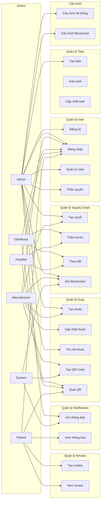

# USE CASE DIAGRAM - HỆ THỐNG QUẢN LÝ CHUỖI CUNG ỨNG DƯỢC PHẨM

## 1. USE CASE DIAGRAM (Mermaid)

```mermaid
graph TB
    %% Actors
    Admin[👤 Admin]
    Manufacturer[🏭 Nhà Sản Xuất]
    Distributor[🚚 Nhà Phân Phối]
    Hospital[🏥 Bệnh Viện]
    Patient[👨‍⚕️ Bệnh Nhân]
    System[⚙️ Hệ Thống]

    %% Use Cases - Quản lý User
    UC1[UC1: Đăng ký tài khoản]
    UC2[UC2: Đăng nhập]
    UC3[UC3: Đăng xuất]
    UC4[UC4: Quản lý thông tin cá nhân]
    UC5[UC5: Quản lý người dùng]
    UC6[UC6: Phân quyền người dùng]
    UC7[UC7: Xác thực email]
    UC8[UC8: Đổi mật khẩu]
    UC9[UC9: Khóa/Mở khóa tài khoản]

    %% Use Cases - Quản lý Drug
    UC10[UC10: Tạo lô thuốc mới]
    UC11[UC11: Cập nhật thông tin thuốc]
    UC12[UC12: Xem danh sách thuốc]
    UC13[UC13: Xem chi tiết thuốc]
    UC14[UC14: Tìm kiếm thuốc]
    UC15[UC15: Thu hồi thuốc]
    UC16[UC16: Tạo QR Code cho thuốc]
    UC17[UC17: Quét QR Code]
    UC18[UC18: Kiểm tra chất lượng thuốc]
    UC19[UC19: Cập nhật thông tin kiểm định]

    %% Use Cases - Quản lý Supply Chain
    UC20[UC20: Tạo chuỗi cung ứng]
    UC21[UC21: Thêm bước vào chuỗi cung ứng]
    UC22[UC22: Cập nhật trạng thái chuỗi cung ứng]
    UC23[UC23: Xem lịch sử chuỗi cung ứng]
    UC24[UC24: Theo dõi vị trí hiện tại]
    UC25[UC25: Ghi dữ liệu lên Blockchain]
    UC26[UC26: Xác minh trên Blockchain]
    UC27[UC27: Kiểm tra điều kiện bảo quản]
    UC28[UC28: Ghi nhận giao hàng]
    UC29[UC29: Ghi nhận nhận hàng]
    UC30[UC30: Cấp phát thuốc cho bệnh nhân]

    %% Use Cases - Quản lý Task
    UC31[UC31: Tạo nhiệm vụ]
    UC32[UC32: Gán nhiệm vụ]
    UC33[UC33: Cập nhật tiến độ nhiệm vụ]
    UC34[UC34: Xem danh sách nhiệm vụ]
    UC35[UC35: Hoàn thành nhiệm vụ]
    UC36[UC36: Hủy nhiệm vụ]
    UC37[UC37: Đính kèm file vào nhiệm vụ]
    UC38[UC38: Thêm cập nhật vào nhiệm vụ]
    UC39[UC39: Đánh giá chất lượng nhiệm vụ]

    %% Use Cases - Quản lý Notification
    UC40[UC40: Gửi thông báo]
    UC41[UC41: Xem thông báo]
    UC42[UC42: Đánh dấu đã đọc]
    UC43[UC43: Xóa thông báo]
    UC44[UC44: Lọc thông báo]
    UC45[UC45: Tạo thông báo lịch trình]

    %% Use Cases - Quản lý Review
    UC46[UC46: Tạo đánh giá]
    UC47[UC47: Xem đánh giá]
    UC48[UC48: Phản hồi đánh giá]
    UC49[UC49: Báo cáo đánh giá]
    UC50[UC50: Đánh giá hữu ích/Không hữu ích]
    UC51[UC51: Xác minh đánh giá]

    %% Use Cases - Quản lý Settings
    UC52[UC52: Cấu hình hệ thống]
    UC53[UC53: Cấu hình Blockchain]
    UC54[UC54: Cấu hình thông báo]
    UC55[UC55: Cấu hình bảo mật]
    UC56[UC56: Quản lý sao lưu]

    %% Use Cases - Báo cáo
    UC57[UC57: Xem báo cáo chuỗi cung ứng]
    UC58[UC58: Xem báo cáo chất lượng]
    UC59[UC59: Xem báo cáo thống kê]
    UC60[UC60: Xuất báo cáo]

    %% Relationships - Admin
    Admin --> UC1
    Admin --> UC2
    Admin --> UC3
    Admin --> UC5
    Admin --> UC6
    Admin --> UC9
    Admin --> UC10
    Admin --> UC11
    Admin --> UC15
    Admin --> UC20
    Admin --> UC21
    Admin --> UC25
    Admin --> UC31
    Admin --> UC32
    Admin --> UC40
    Admin --> UC52
    Admin --> UC53
    Admin --> UC54
    Admin --> UC55
    Admin --> UC56
    Admin --> UC57
    Admin --> UC58
    Admin --> UC59
    Admin --> UC60

    %% Relationships - Manufacturer
    Manufacturer --> UC2
    Manufacturer --> UC3
    Manufacturer --> UC4
    Manufacturer --> UC7
    Manufacturer --> UC8
    Manufacturer --> UC10
    Manufacturer --> UC11
    Manufacturer --> UC12
    Manufacturer --> UC13
    Manufacturer --> UC14
    Manufacturer --> UC15
    Manufacturer --> UC16
    Manufacturer --> UC18
    Manufacturer --> UC19
    Manufacturer --> UC20
    Manufacturer --> UC21
    Manufacturer --> UC25
    Manufacturer --> UC31
    Manufacturer --> UC34
    Manufacturer --> UC40
    Manufacturer --> UC41
    Manufacturer --> UC46
    Manufacturer --> UC47

    %% Relationships - Distributor
    Distributor --> UC2
    Distributor --> UC3
    Distributor --> UC4
    Distributor --> UC7
    Distributor --> UC8
    Distributor --> UC12
    Distributor --> UC13
    Distributor --> UC14
    Distributor --> UC17
    Distributor --> UC21
    Distributor --> UC22
    Distributor --> UC23
    Distributor --> UC24
    Distributor --> UC27
    Distributor --> UC28
    Distributor --> UC29
    Distributor --> UC31
    Distributor --> UC34
    Distributor --> UC35
    Distributor --> UC40
    Distributor --> UC41
    Distributor --> UC46
    Distributor --> UC47

    %% Relationships - Hospital
    Hospital --> UC2
    Hospital --> UC3
    Hospital --> UC4
    Hospital --> UC7
    Hospital --> UC8
    Hospital --> UC12
    Hospital --> UC13
    Hospital --> UC14
    Hospital --> UC17
    Hospital --> UC21
    Hospital --> UC22
    Hospital --> UC23
    Hospital --> UC24
    Hospital --> UC27
    Hospital --> UC29
    Hospital --> UC30
    Hospital --> UC31
    Hospital --> UC34
    Hospital --> UC35
    Hospital --> UC40
    Hospital --> UC41
    Hospital --> UC46
    Hospital --> UC47

    %% Relationships - Patient
    Patient --> UC2
    Patient --> UC3
    Patient --> UC4
    Patient --> UC7
    Patient --> UC8
    Patient --> UC17
    Patient --> UC23
    Patient --> UC41
    Patient --> UC46
    Patient --> UC47
    Patient --> UC48
    Patient --> UC50

    %% Relationships - System
    System --> UC7
    System --> UC16
    System --> UC25
    System --> UC26
    System --> UC40
    System --> UC45
    System --> UC51
    System --> UC56

    style Admin fill:#ff6b6b
    style Manufacturer fill:#4ecdc4
    style Distributor fill:#45b7d1
    style Hospital fill:#96ceb4
    style Patient fill:#ffeaa7
    style System fill:#dda0dd
```

## 2. USE CASE DIAGRAM (UML Style - Mermaid)

```mermaid
graph LR
    subgraph Actors
        A[Admin]
        M[Manufacturer]
        D[Distributor]
        H[Hospital]
        P[Patient]
        S[System]
    end

    subgraph "Quản lý User"
        UC1[Đăng ký]
        UC2[Đăng nhập]
        UC3[Quản lý User]
        UC4[Phân quyền]
    end

    subgraph "Quản lý Drug"
        UC5[Tạo thuốc]
        UC6[Cập nhật thuốc]
        UC7[Thu hồi thuốc]
        UC8[Tạo QR Code]
        UC9[Quét QR]
    end

    subgraph "Quản lý Supply Chain"
        UC10[Tạo chuỗi]
        UC11[Thêm bước]
        UC12[Theo dõi]
        UC13[Ghi Blockchain]
    end

    subgraph "Quản lý Task"
        UC14[Tạo task]
        UC15[Gán task]
        UC16[Cập nhật task]
    end

    subgraph "Quản lý Notification"
        UC17[Gửi thông báo]
        UC18[Xem thông báo]
    end

    subgraph "Quản lý Review"
        UC19[Tạo review]
        UC20[Xem review]
    end

    subgraph "Cấu hình"
        UC21[Cấu hình hệ thống]
        UC22[Cấu hình Blockchain]
    end

    A --> UC1
    A --> UC2
    A --> UC3
    A --> UC4
    A --> UC5
    A --> UC7
    A --> UC10
    A --> UC13
    A --> UC14
    A --> UC17
    A --> UC21
    A --> UC22

    M --> UC2
    M --> UC5
    M --> UC6
    M --> UC8
    M --> UC10
    M --> UC13

    D --> UC2
    D --> UC9
    D --> UC11
    D --> UC12

    H --> UC2
    H --> UC9
    H --> UC11
    H --> UC12

    P --> UC2
    P --> UC9
    P --> UC18
    P --> UC19
    P --> UC20

    S --> UC8
    S --> UC13
    S --> UC17
```

